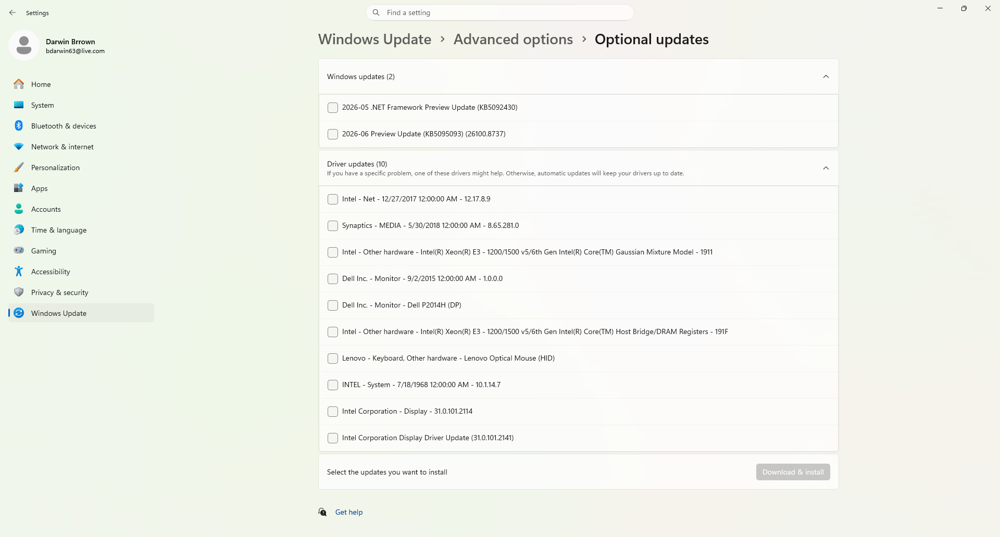
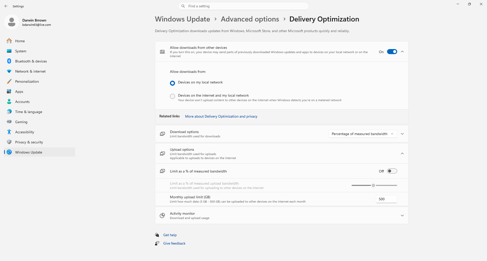
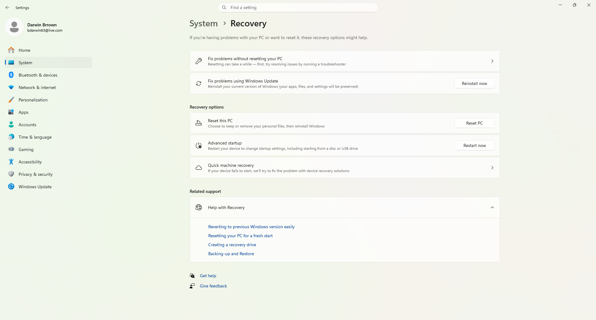
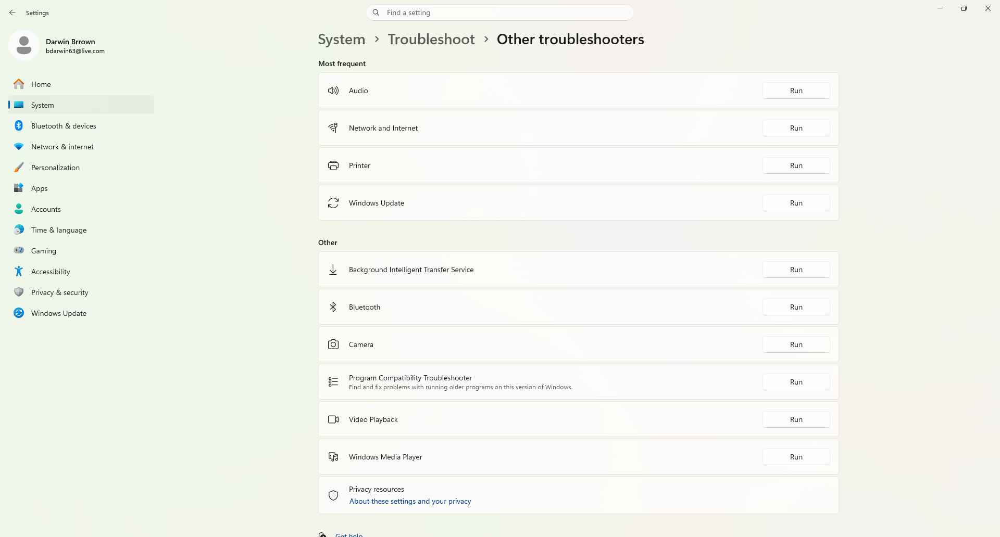
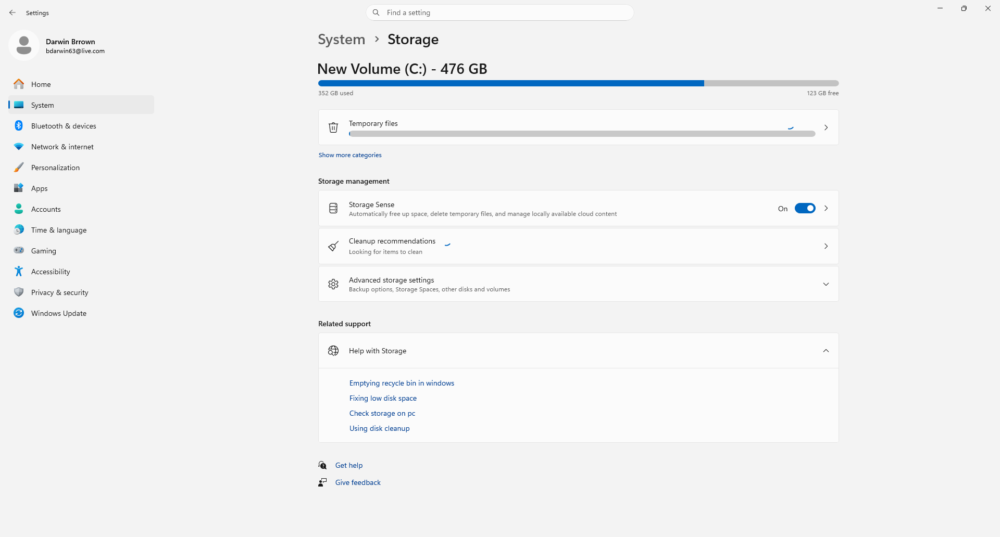

# Darwin Windows Update Troubleshooting Lab

Hands-on Windows 11 Help Desk lab demonstrating Windows Update management, update history, advanced update settings, recovery options, troubleshooting tools, and storage management.

---

## Overview

This project demonstrates common Windows Update administration and troubleshooting tasks performed by Help Desk and IT Support professionals using Windows 11. The lab covers verifying update status, reviewing update history, managing advanced update settings, checking optional updates, configuring Delivery Optimization, reviewing recovery options, accessing built-in troubleshooters, and monitoring storage health.

---

## Skills Demonstrated

- Windows 11 Administration
- Windows Update Management
- Patch Management
- Driver Update Management
- Windows Recovery
- Delivery Optimization
- Storage Management
- Windows Troubleshooting
- Desktop Support
- Help Desk Documentation

---

## Tools Used

- Windows 11 Pro
- Windows Settings
- Windows Update
- Update History
- Advanced Options
- Optional Updates
- Delivery Optimization
- Windows Recovery
- Windows Troubleshooters
- Storage Management

---

# Lab Walkthrough

## 1. Windows Update Home

Verified Windows Update status and confirmed the operating system is receiving updates correctly.


---

## 2. Update History

Reviewed previously installed Windows updates and verified successful security patches.


---

## 3. Advanced Options

Reviewed advanced Windows Update configuration including notifications, active hours, recovery, and delivery settings.


---

## 4. Optional Updates

Reviewed available driver updates and optional Windows updates.



---

## 5. Delivery Optimization

Verified Delivery Optimization settings for Windows Update downloads and bandwidth management.



---

## 6. Recovery Options

Reviewed Windows Recovery features available for repairing or resetting Windows.

Features reviewed:

- Reset this PC
- Advanced Startup
- Recovery Options
- Windows Update Repair



---

## 7. Other Troubleshooters

Reviewed built-in Windows troubleshooters available for diagnosing common system issues.

Examples include:

- Audio
- Network & Internet
- Windows Update
- Bluetooth
- Camera
- Video Playback
- Printer



---

## 8. Storage Management

Reviewed Storage Sense, available storage space, cleanup recommendations, and storage management settings.



---

## Tasks Completed

- Verified Windows Update status.
- Reviewed installed update history.
- Examined Advanced Windows Update settings.
- Reviewed available Optional Updates.
- Verified Delivery Optimization configuration.
- Reviewed Windows Recovery options.
- Examined built-in Windows troubleshooters.
- Reviewed Storage Management and Storage Sense settings.
- Documented Windows Update administration procedures.
- Completed a Windows Update Help Desk troubleshooting lab.

---

## Key Takeaways

- Learned how Windows Update is managed in Windows 11.
- Gained experience reviewing update history and installed patches.
- Understood Optional Updates and driver management.
- Learned how Delivery Optimization manages update downloads.
- Reviewed Recovery tools used to repair Windows installations.
- Became familiar with built-in Windows troubleshooters.
- Verified Storage Sense and storage management features.
- Strengthened Windows 11 administration skills.
- Improved Help Desk documentation practices.
- Built hands-on experience relevant to Tier 1 Help Desk and Desktop Support roles.

---

## Repository Structure

```text
Darwin-Windows-Update-Troubleshooting-Lab/
│
├── README.md
│
└── screenshots/
    ├── 01-windows-update-home.png
    ├── 02-update-history.png
    ├── 03-advanced-options.png
    ├── 04-optional-updates.png
    ├── 05-delivery-optimization.png
    ├── 06-recovery-options.png
    ├── 07-other-troubleshooters.png
    └── 08-storage-management.png
```

---

## Author

**Darwin Brown**
