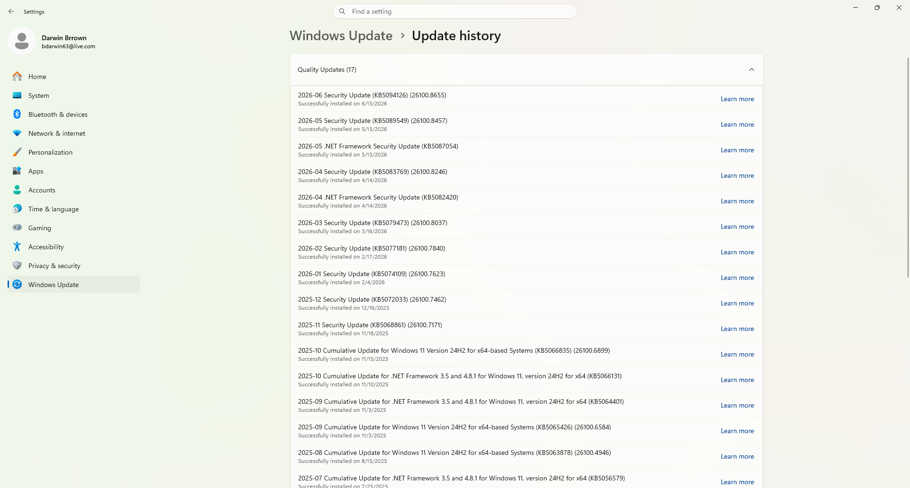

# Darwin Windows Update Troubleshooting Lab

## Overview

This project demonstrates common Windows Update troubleshooting procedures performed by Help Desk and IT Support professionals using Windows 11. The lab covers verifying update status, reviewing update history, managing Windows Update services, analyzing update logs, and confirming successful system updates using built-in Windows administrative tools.

---

## Skills Demonstrated

- Windows 11 Administration
- Windows Update Troubleshooting
- Windows Services
- Event Viewer
- Command Prompt
- Windows Settings
- Windows Maintenance
- Help Desk Troubleshooting
- Technical Documentation

---

## Tools Used

- Windows 11
- Windows Update
- Windows Services
- Event Viewer
- Command Prompt
- Settings

---

## Lab Walkthrough

### 1. Windows Update Home

Opened the Windows Update page to verify update status and review available update options.


---

### 2. Update History

Reviewed previously installed Windows updates and installation history.



---

### 3. Windows Update Service

Verified the Windows Update service status using the Services management console.


---

### 4. Restart Windows Update Service

Restarted the Windows Update service as part of the troubleshooting process.


---

### 5. Command Prompt Verification

Verified Windows Update services using Command Prompt.

```cmd
net stop wuauserv
net start wuauserv
```


---

### 6. Event Viewer

Reviewed Windows Update related events within Event Viewer.


---

### 7. Check for Updates

Performed a manual Windows Update scan to verify update functionality.


---

### 8. Project Complete

Confirmed Windows Update completed successfully and verified system status after troubleshooting.


---

## Troubleshooting Workflow

1. Verify Windows Update status.
2. Review Update History.
3. Verify Windows Update service.
4. Restart Windows Update service.
5. Verify services using Command Prompt.
6. Review Event Viewer logs.
7. Check for updates.
8. Confirm successful update operation.

---

## Commands Used

```cmd
net stop wuauserv

net start wuauserv

Get-Service wuauserv
```

---

## Project Outcome

- Verified Windows Update configuration.
- Reviewed update history.
- Confirmed Windows Update service functionality.
- Restarted Windows Update service.
- Reviewed update logs.
- Successfully verified Windows Update operation.
- Documented a complete Windows Update troubleshooting workflow.

---

## Resume Highlights

- Performed Windows Update troubleshooting using Windows administrative tools.
- Verified Windows Update services and update history.
- Reviewed Event Viewer logs to investigate update-related issues.
- Restarted Windows Update services using Command Prompt.
- Documented a complete Windows Help Desk troubleshooting workflow.

---

## Author

**Darwin Brown**
